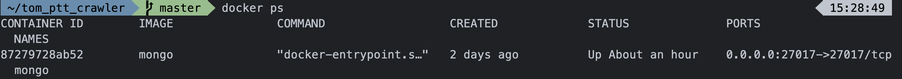

# Tom PTT Crawler

A crawler for crawling all the catalogue for ptt.


## SMTP Setting

Using gmail to set up smtp service.


Open the file  ``` scrapy_tom_ppt_crawer.py```


Change **XXXXX@gmail.com** to your gmail as you wish to sent it from.

Change **XXXXX** to your password for gmail.

Change **ANY_EMAIL** to user email as you want to receive.


### Security setting

Go to your  **Google account**  => **Security** => **Less secure app access**


To enable your less secure app access, which will allow you to access using unknow device to sent email though SMTP.


## Run MongoDB from Docker

Run Mongodb as container

```
docker run -itd --name mongo -p 27017:27017 mongo
```


To check the whether Mongodb container is alive

```
docker ps
```




## Start Crawling

**ROCK and ROLL ~**


### To execute crawler in ppt

```
python scrapy_tom_ppt_crawer.py
```

or

```
python3 scrapy_tom_ppt_crawer.py
```

To see this screenshot will start crawling, and finsih will print it on the screen.


### Result in CSV file

It will genarate a result file called "ppt_result.csv", cause I recond the csv file is allways better to use for analysis.


### To show container in docker

The data will also save in Mongodb.

```
docker ps
```


### Access in Mongodb

```
docker exec -it mongo mongo
```


### MongoDB  QUEREY

```
show dbs

use IT_DB

show collections

db.IT_coll.find()
```

Below image shows : crawler has store all the data in Mongodb.


##  ERROR Detection

If cannot connet to MongoDB will sent the email to user.

